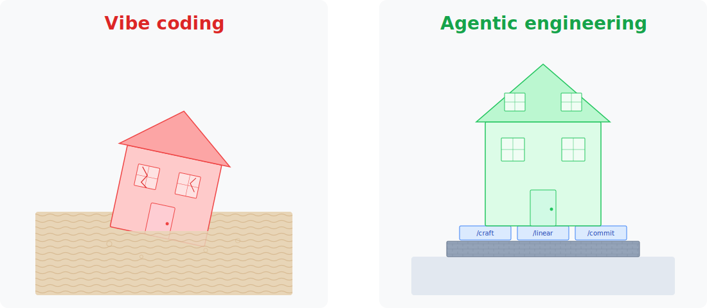

# codefu-core

<mark>Vibe coding builds on quicksand. The first few stories go up fast, but a few changes later the house is tipping over and you can't tell which wall is load-bearing.</mark>

Vibe coding is great on day one — you describe what you want, the agent builds it, and within minutes you have a running app. But by day ten you can't tell which change broke things. By day thirty you're afraid to touch anything. By day ninety you're rewriting from scratch.



codefu-core gives you a **solid foundation from the start** — three Claude Code skills that turn you from a vibe coder into an [agentic engineer](docs/reference/agentic-engineering.md). Everything installs as plain markdown into your `.claude/` directory. No runtime dependencies, no lock-in — read it, change it, make it yours.

## What you get

**`/linear`** — Five commands covering the full development cycle. Plan work, create issues, implement on a branch, handle PR feedback, merge and close — all driven from Claude Code, all synced with [Linear](https://linear.app). This is an opinionated choice — Linear is keyboard-driven, git-integrated, and built for the way modern software teams actually work.


*Issues flow from Backlog through In Progress to Done — driven entirely by `/linear` commands.*

**`/commit`** — Four-pass atomic commits, called by `/linear` at every commit point. The agent stages selectively, checks coherence, verifies formatting, and writes commit messages that explain *why*, not just what. Every commit is one complete logical change, independently revertible.


*Four passes separate content decisions from formatting standards — catching the mistakes AI agents make.*

**`/craft`** — Structured prompt generation using the **C.R.A.F.T.** framework (Context, Role, Action, Format, Target). Built into `/linear:plan-work --craft` to sharpen issue descriptions *before* the agent drafts them. Without it, the agent works from whatever you typed — ambiguity in, ambiguity out. With it, you get a clear problem statement, well-scoped goals, and acceptance criteria that the agent can actually execute against.

## The loop

The skills aren't independent — each one feeds the next.

`/craft` sharpens the problem. `/linear` turns it into a tracked issue and manages the full lifecycle. `/commit` records each change as one atomic, revertible unit. Remove any piece and the loop still works, but the output gets worse.

## Install

```bash
npx github:webventurer/codefu-core
```

This copies skills, commands, hooks, and docs into your project. It merges hook config into your existing `.claude/settings.json` (or creates one). Nothing is installed globally.

## Quick start

```bash
# See what needs doing
/linear:next-steps

# Plan and create an issue
/linear:plan-work "add dark mode toggle"

# Implement it — branch, code, test, PR
/linear:start PG-123

# Commit your changes
/commit

# Address review feedback
/linear:fix PG-123

# Merge, clean up, done
/linear:finish PG-123
```

## Docs

Full documentation at the [docs site](https://webventurer.github.io/codefu-core) or run locally:

```bash
pnpm dev
```

## Built by


[@mikemindel](https://github.com/mikemindel)

## License

[MIT](LICENSE)
