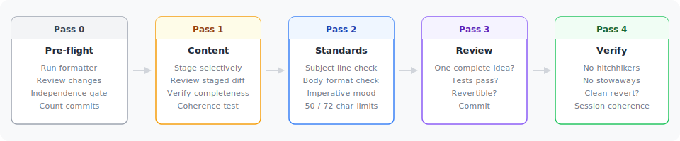
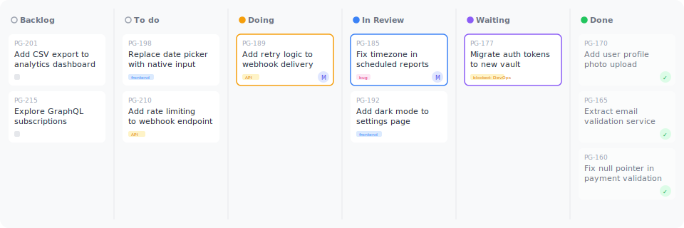

# codefu-core

<mark>When AI agents write code, the quality of git history becomes a make-or-break concern.</mark>

Agents can produce large volumes of changes in a single session. Without discipline, those changes land as **monolithic commits** — impossible to review, difficult to revert, and dangerous to bisect. And without a connection to *why* the work exists, the agent operates in isolation — shipping code that nobody asked for, or solving the wrong problem entirely.

codefu-core gives you three Claude Code skills that turn you from a **vibe coder** into an **agentic engineer** — atomic commits where every commit is one complete conceptual unit of work, a [Linear](https://linear.app) workflow that ties every change to a real objective, and structured prompt generation that sharpens your thinking before the agent starts.

Everything installs as plain markdown into your `.claude/` directory. No runtime dependencies, no lock-in — read it, change it, make it yours.


## What you get

**`/commit`** — Four-pass atomic commits. The agent stages selectively, checks coherence, verifies formatting, and writes commit messages that explain *why*, not just what. Every commit is one complete logical change, independently revertible.


*Four passes separate content decisions from formatting standards — catching the mistakes AI agents make.*

**`/linear`** — Five commands covering the full development cycle. Plan work, create issues, implement on a branch, handle PR feedback, merge and close — all driven from Claude Code, all synced with Linear.


*Issues flow from Backlog through In Progress to Done — driven entirely by `/linear` commands.*

**`/craft`** — Structured prompt generation using the C.R.A.F.T. framework. Also powers `/linear:plan-work --craft` to sharpen issue descriptions before the agent drafts them.

## Install

```bash
npx github:webventurer/codefu-core
```

This copies skills, commands, hooks, and docs into your project. It merges hook config into your existing `.claude/settings.json` (or creates one). Nothing is installed globally.

## Quick start

```bash
# See what needs doing
/linear:next-steps

# Plan and create an issue
/linear:plan-work "add dark mode toggle"

# Implement it — branch, code, test, PR
/linear:start PG-123

# Commit your changes
/commit

# Address review feedback
/linear:fix PG-123

# Merge, clean up, done
/linear:finish PG-123
```

## Docs

Full documentation at the [docs site](https://webventurer.github.io/codefu-core) or run locally:

```bash
pnpm dev
```

## License

[MIT](LICENSE)
