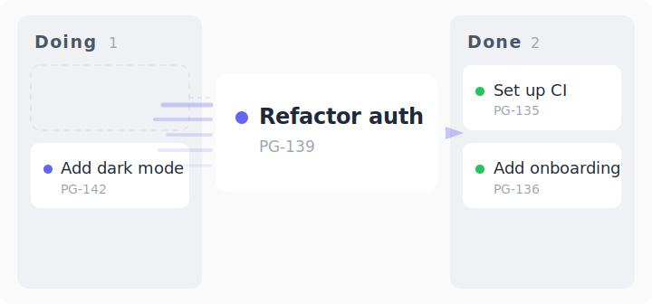

# stride

**All the speed. None of the mess.**

AI agents write code fast. But without structure, that speed turns into entropy — monolithic commits, untraceable history, and a codebase you're afraid to touch by day thirty.

stride gives you **atomic commits** — every change is one idea, independently revertible, with a reason attached. You get AI speed *and* a git history you can trust. That's the trade: you don't have to choose between fast and clean.

Everything installs as plain text into your `.claude/` directory — markdown skills and commands plus a small Python helper for Linear. No compiled binaries, no build step, no lock-in — read it, change it, make it yours.

## What you get

**`/vision`** — The guiding light. One canonical `VISION.md` at the repo root: what the project delivers, why it exists, what success looks like. Every issue, every feature, every architectural decision traces back to it. `/linear:plan-work` enforces this — issues drafted in a vacuum get flagged for trace-back, not just warned. Vision evolves rarely and reads as stakeholder language; the rest of stride's loop runs against it. *(Planning, ranking, and implementation all read `VISION.md` before deciding anything — that's the upstream-anchor role.)* See [the `/vision` skill](https://webventurer.github.io/stride/skills/vision) for the seven-question walkthrough.

**`/linear`** — Commands covering the full development cycle. Plan work, create issues, implement on a branch, handle PR feedback, merge and close — all driven from Claude Code, all synced with [Linear](https://linear.app). Issues flow through your board automatically as you work.


*Issues flow from Backlog through In Progress to Done — driven entirely by `/linear` commands.*

**`/commit`** — Multi-pass atomic commits, called by `/linear` at every commit point. The agent stages selectively, checks coherence, verifies formatting, and writes commit messages that explain *why*, not just what. Every commit is one complete logical change, independently revertible.


*Multiple passes separate content decisions from formatting standards — catching the mistakes AI agents make.*

**`/craft`** — Structured prompt generation using the **C.R.A.F.T.** framework (Context, Role, Action, Format, Target). Built into `/linear:plan-work --craft` to sharpen issue descriptions *before* the agent drafts them. Without it, the agent works from whatever you typed — ambiguity in, ambiguity out. With it, you get a clear problem statement, well-scoped goals, and acceptance criteria that the agent can actually execute against.

## The loop

The skills aren't independent — each one feeds the next.

`/vision` sets the destination. `/craft` sharpens the problem. `/linear` turns it into a tracked issue (anchored to a Vision outcome) and manages the full lifecycle. `/commit` records each change as one atomic, revertible unit. Remove any piece and the loop still works, but the output gets worse.

## Install

```bash
npx github:webventurer/stride
```

This copies skills, commands, hooks, and docs into your project. It merges hook config into `.claude/settings.local.json` (gitignored, machine-local — your committed `settings.json` is never modified). Nothing is installed globally.

Before your first `/linear:*` command, install the prerequisites — `gh`, `uv`, `jq` — and add a Linear API key to `~/.env` — one key per workspace (`LINEAR_<WORKSPACE>_API_KEY`), selected per repo via `.stride.json`. On Windows that means working inside WSL (the hooks need a bash/zsh shell). See [Install](https://webventurer.github.io/stride/install) for the one-time setup.

## Quick start

```bash
# Verify stride can reach your Linear workspaces
/linear:check

# See what needs doing
/linear:next-steps

# Plan and create an issue
/linear:plan-work "add dark mode toggle"

# Implement it — branch, code, test, PR
/linear:start PG-123

# Commit your changes
/commit

# Address review feedback
/linear:fix PG-123

# Merge, clean up, done
/linear:finish PG-123
```

## Migration skills

Two additional skills for migrating issues between workspaces live on the `migrate` branch. They're kept separate to keep the main install lightweight — you only need them when moving cards.

```bash
git checkout migrate
python -m venv .venv && source .venv/bin/activate
make install
```

| Skill | What it does |
|:------|:-------------|
| `/linear-to-linear` | Copy issues between Linear workspaces — descriptions, comments, labels, attachments, images, and state |
| `/trello-to-linear` | Migrate Trello cards to Linear issues — descriptions, comments, and checklists |

Both skills walk you through source/target selection interactively. Each phase has its own script with dry-run support. Switch back to main when you're done: `git checkout main`.

## Why this exists

Vibe coding is great on day one. By day ten you can't tell which change broke things. By day thirty you're afraid to touch anything. By day ninety you're rewriting from scratch.

stride trades a few minutes of setup for months of maintainability. Atomic commits make reverting safe. Linear integration makes priorities visible. Structured prompts make the agent's starting point explicit. The structure compounds — as AI models improve, it gets *more* from them, not less.

Read more about [agentic engineering](https://webventurer.github.io/stride/reference/agentic-engineering) — the philosophy behind the approach.

## Docs

Full documentation at the [docs site](https://webventurer.github.io/stride) or run locally:

```bash
pnpm dev
```

## Built by



[@mikemindel](https://github.com/mikemindel)

## License

[MIT](LICENSE)
